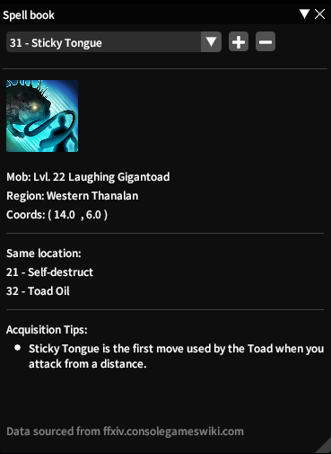

# Blue Mage Helper

A Dalamud plugin for Final Fantasy XIV.

This repository is for development! If you just want to use this addon, you'll need to install the [FFXIV Quick Launcher](https://github.com/goatcorp/FFXIVQuickLauncher) and read the 
[FAQ](https://goatcorp.github.io/faq/dalamud_troubleshooting.html#q-how-do-i-installenable-plugins).

## Features 
This plugin expands the information provided by the Blue Mage Spellbook's "Where to Learn" section for each spell, telling which monster you'll have to defeat, its level, and its coordinates if it can be 
found in the open world.

## Spell book
A small guide book to help on your journey.  

Coords: click to open your map with flag on the location.  
Same location: click skills to open there page.

### Planned Features
- Alternate locations and monsters
- Marking enemies with unlockable spells 

